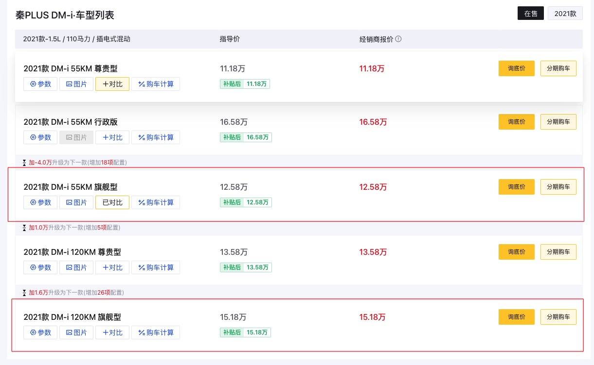
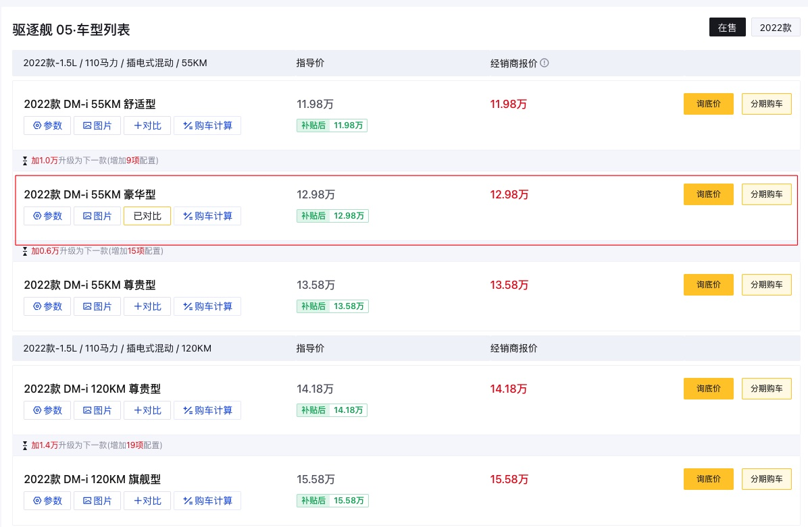

# BYD-carlife

中国大陆购买比亚迪汽车做的一些功课&玩车记录

## 声明

本仓库非广告, 偏主观, 纯属个人分享欲的释放, 请审慎观看, 你应该为自己的最终决定负责.

## 本仓库目的

由于工作 fully remote 的性质, 2022 年大部分时间处于在家办公的状态. 在家里实在是非常无聊, 精神状态会受到较大的影响, 非常容易 emo. 2022 12 月以后中国大陆全面放开, 可以预见的是疫情将快速到达峰值并形成群体免疫, 整个社会正在以不可阻挡的速度走向开放、回归正常, 如 2019 年以前的那样. 2023 年我计划改变生活方式, 改变生活方式从出行开始, 于是计划购买一辆汽车.
前景是乐观的, 但是客观的经济数据不容乐观, 全球经济在衰退, 个人的现金流因此显得更为重要. 我的预算为 15 万人民币, 目标品牌为比亚迪. 本仓库记录研究购买比亚迪汽车过程中的一些材料以及后续的玩车经历. 也希望顺便能帮助到中文互联网的其他网友.

## 购车

### 前置条件

- 符合准驾车型的驾照
- 存款

### 预算

买车应该首先明确自己的预算有多少, 然后依据预算粗选车型.

我的预算是 15 万以内. 不用被互联网的焦虑信息绑架, 钱在我们手上, 想花多少怎么花都应该由我们做主. 要制定自己经济能力范围内的预算.

### 需求

明确自己想要什么? 我是第一次买自己的车, 不过先前试驾过纯电的小鹏 p7、增程式混动理想 one, 租过燃油车大众朗逸 2021、大众帕萨特、日产轩逸, 累计行驶里程大约有 2000 公里. 我对驾驶有了一点点了解, 对各种术语、以及操作有了一些体验.

车辆的审视维度大致有以下几种:

- 价格预算
- 品牌信仰
- 外观, 工业设计
- 动力类型
- 性能
- 能耗
- 内部空间
- 故障率
- 驾驶体验
- 保值率
- 等等其他 feature

如果你对上述名词没有概念, 建议你先租车开开增加一些体验.

于我而言, 我关注预算, 保证现金流健康;性能动力, 油门反馈不能太慢; 油车这个预算内的我开过体验较好的是朗逸 2021, 但是油门反馈严重滞后;能耗, 不能太费能量; 驾驶体验, 这点比较主观, 是比较综合的, 涵盖了整车的操作体验.

最终我目标落在了比亚迪的 DMi 轿车车型, 驱逐舰 05 和秦 Plus

#### 对比

55km 和 120km 怎么选, 网友们说到最多的一条原则, 有充电桩 120, 反之 55. 也有网友认为 120 版本的动力更强劲以及特别的功能如车道辅助非常有用, 推荐直接顶配.

每个机型分化出的多个版本怎么选? 秦 Plus 55km 和 120km 各两款; 驱逐舰则分别是三款和两款.
驱逐舰我去问的时候大多没有现货, 试驾了几次秦 plus dmi, 了解更多. 关注点更多在秦. 如果你要对比, 可以用懂车帝的对比工具, 以表格形式逐项对比两车的特点来确定你想要的型号.

#### 谈价

消费者和销售是处于利益对立面的, 在谈判中不可能成为朋友. 议价是我们的权利, 但对事不对人, 没有必要对销售人员颐指气使.

卖比亚迪车的店铺大致有两种,一种是直营店铺,售价是固定的,销售的策略大多集中在赠品,包括车膜、保养之类的;一种是经销商店, 这种店的车价可议, 另外赠品方面也是可以进一步沟通的.

购车时间节点,最好选择时间节点的末尾,年末、月末、周末, 店铺通常有销售压力, 会选择让利换取业绩.

价格一定要货比三家, 对比个几家下来完全有可能获得三五千的差价.

我在懂车帝上发布询价的请求以后, 很快就有很多店铺的销售联系我.

最初我在店铺 A 得到的优惠是 151800(问的是 120 顶配) 区域补贴减 3500 然后送原厂膜、免上牌费用、空气净化、6 次保养
然后我前往 B 店铺,把上面的报价稍加夸大报给销售,

> 125800(后来权衡了一下觉得多花两万块升级 120 顶配不值) 车价减 1000(夸大部分)然后区域补贴减免 3500 然后送膜、免上牌费用、空净、8 次保养(夸大)、**交强险(夸大,价值 950)**

经过一番 battle, B 的销售给的报价是 125800 减免 3000 然后送 2000 的京东卡, 免上牌费用, 送交强险(¥950)、净水器(小东西无所谓)、原厂膜(不知道龙膜和原厂膜区分, 不然肯定要贵的)、8 次保养.

谈的差不多了,准备签合同了.

这时候又有其他店铺 C 的销售联系我了, 他们的店不远. 我将上述的报价报给这个 C 的销售, 他们答应加一箱油, 我说直接优惠 1000 块钱吧. 经过一会儿的软磨硬泡, 这个销售是同意了, 并且让我直接去他们那里谈. 我突然 get 到,这里还有底可以下探.

其实我们消费者核心诉求是获得同样产品的可能低的价格, 并不关注到底是哪家店铺提供的, 如果这些店铺有同样的资质, 产品和服务类似的话.

于是我将 C 店销售的报价中多的 1000 告知 B 店销售,并希望获得同样的待遇, 否则就选择 C 店了.

这里心还是软了, 不然再加一点诈一下完全有可能的. 对事不对人, 我们心平气和地表达诉求是完全合理的, 不要有任何心理负担和羞涩.

B 店铺又磨了一会, 在这种明牌面前, 我觉得他们几乎没有选项, 最后是答应再加一千的京东卡.

最终的写到合同上的价格以及赠品是:

> 125800 减免 3000 然后送 3000 的京东卡, 免上牌费用, 送交强险(¥950)、净水器、原厂膜、8 次保养.

所以, 裸车价是 119800
商业保险, 去掉交强险, 是 3750
落地价应该是 **123550**, 这个结果我还是比较满意的

总结砍价要点:
注意直营店和经销商店的区别. 新人上来肯定是懵的, 核心是逐步向下找到价格锚点.

- 选对时间点. 销售点需要订单的时候上门, 他们自然格外重视, 愿意更多让利. 一个周期的末尾通常他们的销售压力比较大, 值得一试.
- 如果在乎几千块钱的优惠, 多问几个 4s 店. 一个“自杀式”的找 4s 店的方法, 直接在懂车帝、汽车之家上发起询价,这样很快就有销售主动联系了. 这种方法比主动找电话、打电话效率高多了. 但是电话有可能会炸掉.
- 砍价不清楚底线在哪, 就以子之矛陷子之盾, 用 A 店铺的报价去 B 那里试探, 刚开始的攀比非常凶猛,优惠上涨很明显, 循环下去一定能找到愿意降低利润做单的店.
- 心要狠, 对卖家的心软, 受伤的就是自己的钱包. 合情合理, 不要胆怯、不好意思. 钱在手里, 心要硬气.

##### 参考

[B 站《经理有话说》:曾经的 4S 店销售经理，带你买车砍价，带你飞！](https://www.bilibili.com/video/BV1ei4y1M7Yk)
[B 站《备胎说车》: 1 字千金，买车时说了这 4 句话，小心被坑哭](https://www.bilibili.com/video/BV1ob4y1B7vZ)
[B 站《备胎说车》: 在 4S 店买车，怎样砍价才能底价成交？](https://www.bilibili.com/video/BV1fA411j7rB)

#### 提车验车

[提车验车](./withdraw-my-car.md)

## 玩车 todo

### 车机软件

#### CarPlay

#### Apple Music
